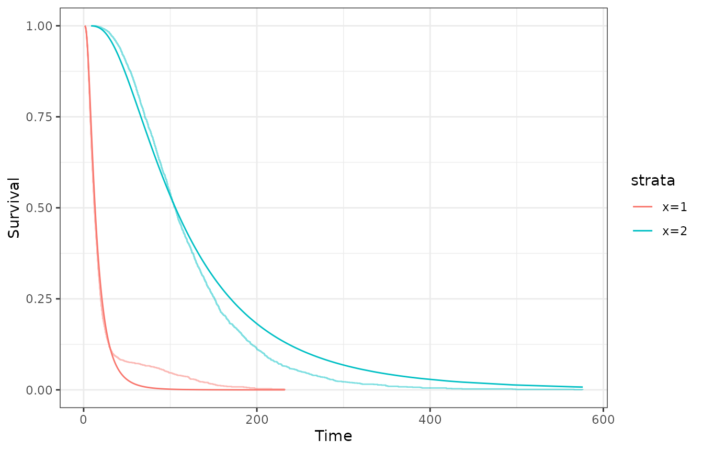
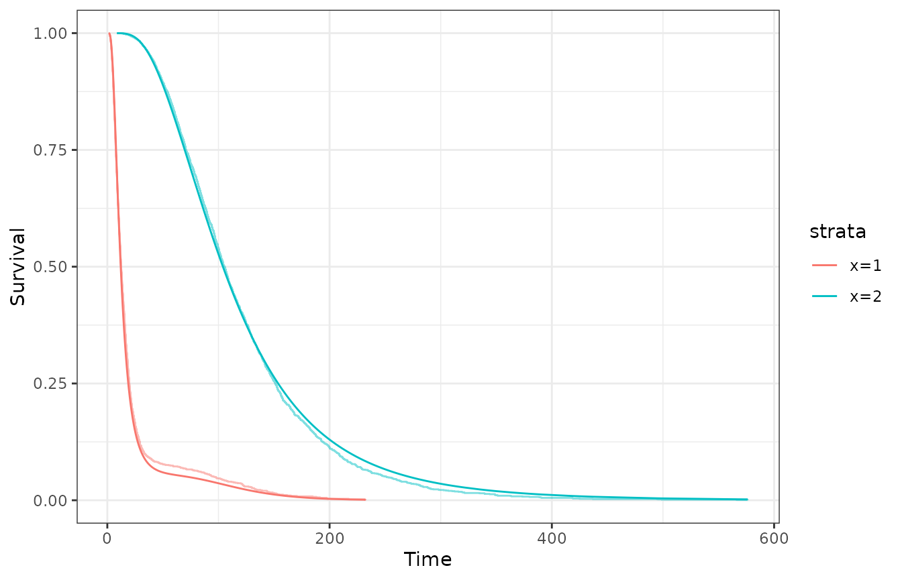

# Expectation Maximization

The Expectation-Maximization (EM) algorithm is available through the
function `survival_ln_mixture_em` and it’s a frequentist method in
alternative to the Bayesian approach. It handles better big data
situations when the Bayesian approach will run out of memory or take a
lot of time to finish.

Using it is similar to using the Bayesian method, `survival_ln_mixture`,
sharing a lot of similar parameters and specifications. Here follows a
really basic code to fit the model using the EM algorithm.

``` r

library(lnmixsurv)
library(tidyr)
library(dplyr)
library(ggplot2)
library(readr)

set.seed(8)

data <- simulate_data(6000,
  mixture_components = 3, k = 2,
  percentage_censored = 0.3
)$data |>
  rename(x = cat, y = t)

model_em <- survival_ln_mixture_em(Surv(y, delta) ~ x,
  data = data,
  iter = 200,
  starting_seed = 20,
  number_em_search = 0
)

gg <- plot_fit_on_data(model_em, data)$ggplot
```

The parameters `number_em_search` is used to find initial values closer
to the maximum likelihood, avoid local maximas. Here, we are just
disabling it to show it’s impact.

Unlike the Bayesian approach, which samples from the posteriori via
Gibbs sampler, the EM algorithm is a maximum likelihood method, moving,
in each iteration, closer the parameters values closer to the model’s
maximum likelihood. The function `plot` can be used to visualize the
iterations of the algorithm, assessing for convergence.

``` r

plot(model_em)
```

When using the Expectation-Maximization algorithm to fit the model, you
can use the function
[`plot_fit_on_data()`](https://vivianalobo.github.io/lnmixsurv/reference/plot_fit_on_data.md)
to quickly visualize the model’s estimated survival (or hazard) on the
data used to fit the model.

``` r

plot_fit_on_data(model_em, data = data, type = "survival")$ggplot
```



As expected, the fitted model isn’t that great. Increasing the parameter
`number_em_search` helps to find better initial values, and thus, better
fits, in exchange of computational time. We can see how the initials
values likelihood change setting the parameter `show_progress = TRUE`.

``` r

model_em <- survival_ln_mixture_em(Surv(y, delta) ~ x,
  data = data,
  iter = 200,
  starting_seed = 20,
  number_em_search = 200,
  show_progress = TRUE
)
#> Initial LogLik: -30771.2
#> Previous maximum: -30771.2 | New maximum: -19065.3
#> Previous maximum: -19065.3 | New maximum: -15020.4
#> Starting EM with better initial values
#> EM Iter: 20 | 200
#> EM Iter: 40 | 200
#> EM Iter: 60 | 200
#> EM Iter: 80 | 200
#> EM Iter: 100 | 200
#> EM Iter: 120 | 200
#> EM Iter: 140 | 200
#> EM Iter: 160 | 200
#> EM Iter: 180 | 200
#> EM Iter: 200 | 200
```

Now, we have a maximum likelihood estimator that tries to avoid local
maximas. As before, we can use the function
[`plot_fit_on_data()`](https://vivianalobo.github.io/lnmixsurv/reference/plot_fit_on_data.md)
to visualize the model’s estimated survival on the data used to fit the
model.

``` r

plot_fit_on_data(model_em, data = data, type = "survival")$ggplot
```



In fact, the model is now much better. The EM algorithm is a good
alternative to the Bayesian approach when dealing with big data, but
it’s important to note that it’s a maximum likelihood method, and thus,
it doesn’t provide credible nor confidence intervals.
