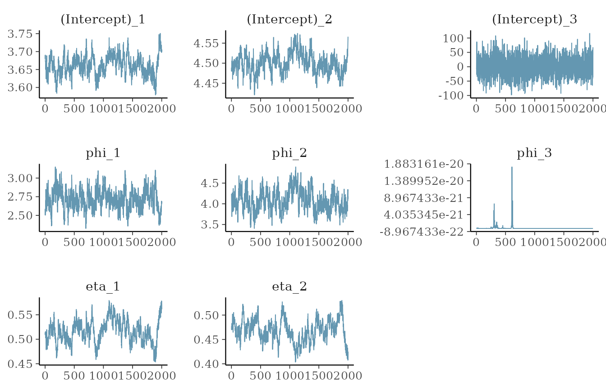
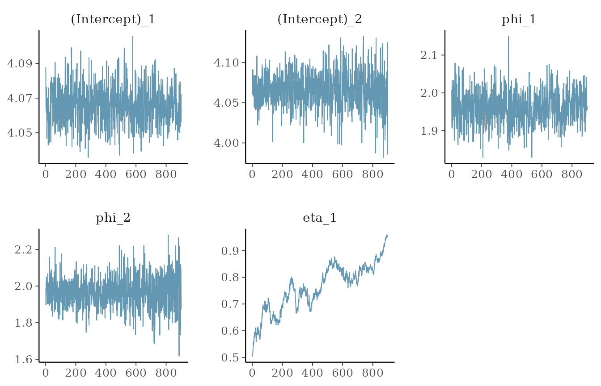
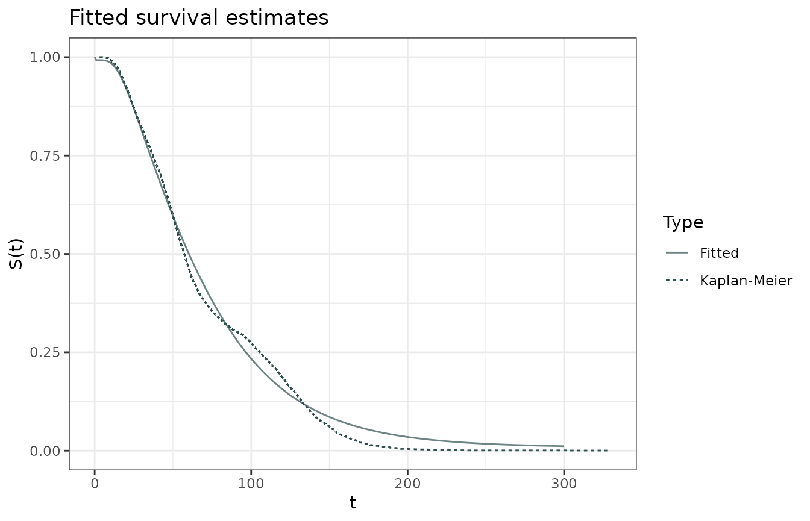

# Intercept only fits

Intercept only fits should be done setting `intercept = TRUE` and using
`NULL` for the left side of the formula.

``` r

library(lnmixsurv)
library(dplyr)
library(tidyr)
library(readr)

mod1 <- survival_ln_mixture(Surv(y, delta) ~ NULL,
  sim_data$data,
  iter = 4000,
  warmup = 2000,
  intercept = TRUE,
  starting_seed = 15,
  em_iter = 50,
  mixture_components = 3
)

chains <- bayesplot::mcmc_trace(mod1$posterior)
```

We can easily see the chains with the `mcmc_trace()` function from
`bayesplot` package. Since it’s just an example, we don’t expect that
the chains have already converged.

``` r

bayesplot::mcmc_trace(mod1$posterior)
```



Furthermore, we can use the `ggplot2` package to visualize the
Kaplan-Meier survival estimates, created with the
[`survfit()`](https://rdrr.io/pkg/survival/man/survfit.html) function
from the `survival` package and the
[`tidy()`](https://generics.r-lib.org/reference/tidy.html) function from
the `broom` package.

``` r

km <- survival::survfit(
  Surv(y, delta) ~ NULL,
  sim_data$data
) |>
  broom::tidy() # Kaplan-Meier estimate

ggplot(km) +
  geom_step(aes(x = time, y = estimate),
    color = "darkslategrey"
  ) +
  labs(
    title = "Kaplan-Meier estimate",
    x = "t",
    y = "S(t)"
  ) +
  theme_bw()
```



The predictions can be easily made with a “empty” data.frame with one
row.

``` r

predictions <- predict(mod1,
  new_data = data.frame(val = NA),
  type = "survival",
  eval_time = seq(0, 300)
) |>
  tidyr::unnest(cols = .pred)
```

`ggplot2` can be used to visualize the model’s fitted survival estimates
for the data.

``` r

ggplot() +
  geom_step(aes(x = time, y = estimate, linetype = "Kaplan-Meier"),
    color = "darkslategrey", data = km
  ) +
  geom_line(aes(x = .eval_time, y = .pred_survival, linetype = "Fitted"),
    color = "darkslategrey",
    data = predictions, alpha = 0.7
  ) +
  labs(
    title = "Fitted survival estimates",
    x = "t",
    y = "S(t)",
    linetype = "Type"
  ) +
  theme_bw()
```


