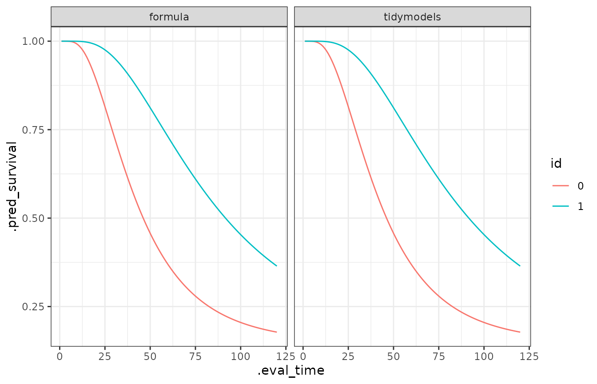

# Get started

The model can be used with the usual formula interface or using the
`tidymodels` and `censored` structure.

Formula interface:

``` r

library(lnmixsurv)
library(readr)

mod1 <- survival_ln_mixture(Surv(y, delta) ~ x,
  sim_data$data,
  starting_seed = 20
)

mod1
#> survival_ln_mixture
#>  formula: Surv(y, delta) ~ x
#>  observations: 10000
#>  predictors: 2
#>  mixture groups: 2
#> ------------------
#>                estimate   std.error   cred.low  cred.high
#> (Intercept)_1 3.7005261 0.008960928  3.6806331  3.7172540
#> x1_1          0.6860558 0.014259390  0.6567678  0.7159473
#> (Intercept)_2 9.4916865 0.162788376  9.1774007 10.4140407
#> x1_2          0.1611774 0.613334336 -0.6222087  1.6970175
#> 
#> Auxiliary parameter(s):
#>        estimate   std.error  cred.low  cred.high
#> phi_1 2.6484958 0.048153081 2.5617748  2.7470933
#> phi_2 3.9597761 2.912488989 1.5340432 12.6942993
#> eta_1 0.8551168 0.003429121 0.8482826  0.8617482
```

Tidymodels approach:

``` r

library(censored)
library(ggplot2)
library(dplyr)
library(tidyr)
library(purrr)

mod_spec <- survival_reg() |>
  set_engine("survival_ln_mixture", starting_seed = 20) |>
  set_mode("censored regression")

mod2 <- mod_spec |>
  fit(Surv(y, delta) ~ x, sim_data$data)
```

The estimates are easily obtained using tidy method. See
[`?tidy.survival_ln_mixture`](https://vivianalobo.github.io/lnmixsurv/reference/tidy.survival_ln_mixture.md)
for extra options.

``` r

tidy(mod1)
#> # A tibble: 4 × 3
#>   term          estimate std.error
#>   <chr>            <dbl>     <dbl>
#> 1 (Intercept)_1    3.70    0.00896
#> 2 x1_1             0.686   0.0143 
#> 3 (Intercept)_2    9.49    0.163  
#> 4 x1_2             0.161   0.613
tidy(mod2)
#> # A tibble: 4 × 3
#>   term          estimate std.error
#>   <chr>            <dbl>     <dbl>
#> 1 (Intercept)_1    3.70    0.00896
#> 2 x1_1             0.686   0.0143 
#> 3 (Intercept)_2    9.49    0.163  
#> 4 x1_2             0.161   0.613
```

The predictions can be easily obtained from a fit.

``` r

library(ggplot2)
library(dplyr)
library(tidyr)
library(purrr)

models <- list(formula = mod1, tidymodels = mod2)

new_data <- sim_data$data |> distinct(x)
pred_sob <- map(models, ~ predict(.x, new_data,
  type = "survival",
  eval_time = seq(120)
))

bind_rows(pred_sob, .id = "modelo") |>
  group_by(modelo) |>
  mutate(id = new_data$x) |>
  ungroup() |>
  unnest(cols = .pred) |>
  ggplot(aes(x = .eval_time, y = .pred_survival, col = id)) +
  geom_line() +
  theme_bw() +
  facet_wrap(~modelo)
```


